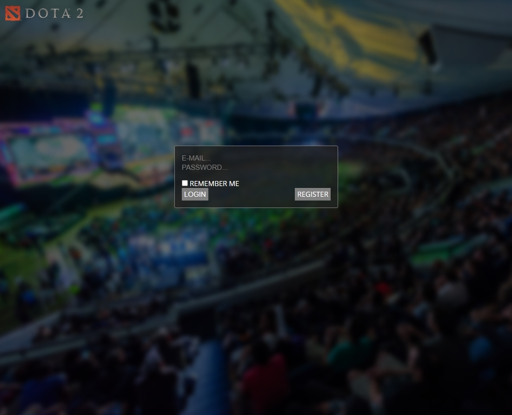
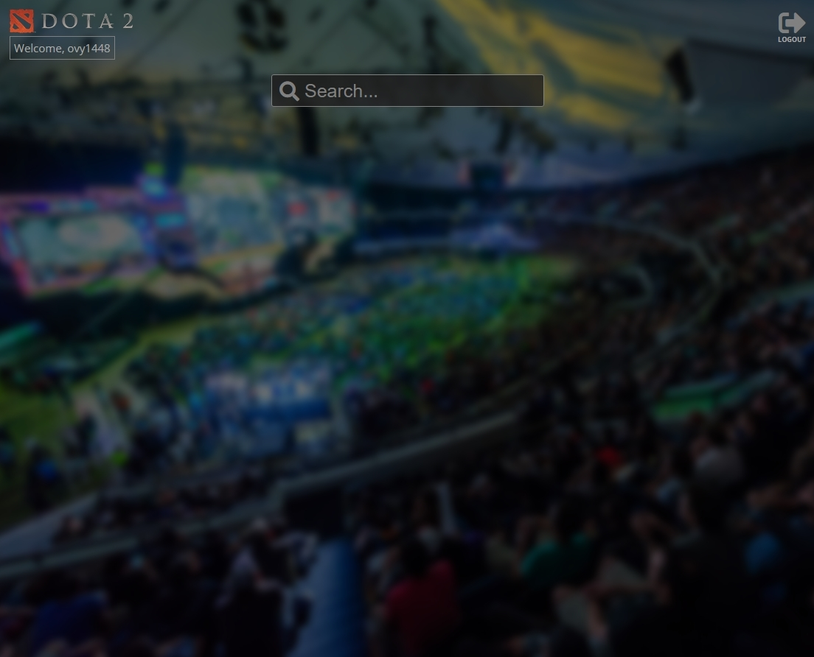
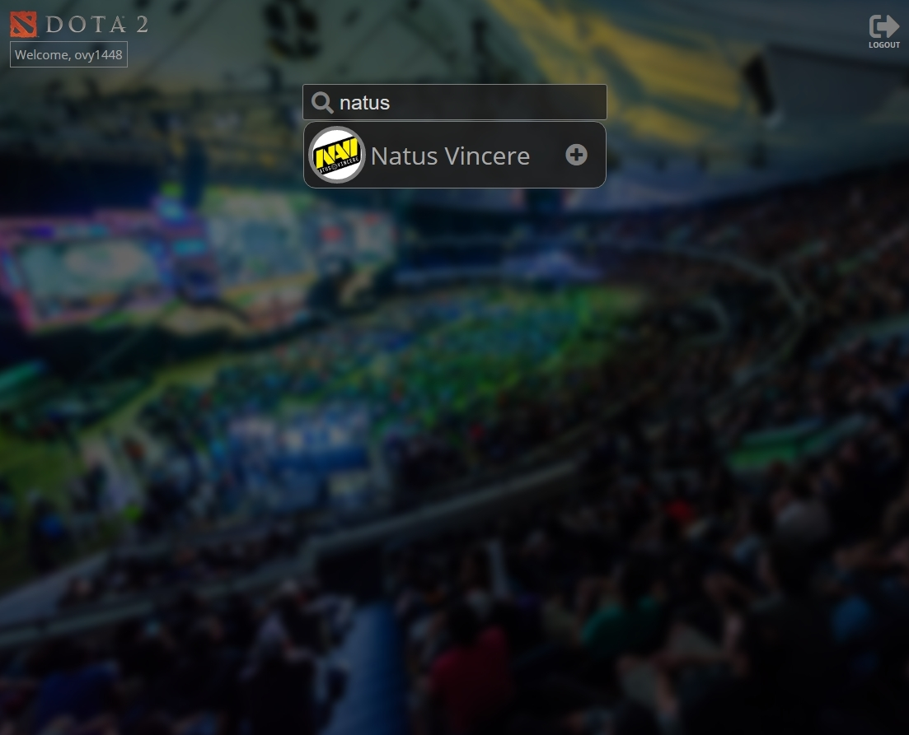

(CURRENTLY WORKING ON, NOT YET FINISHED)
* **About:**
  - Site, made with *PHP Laravel*, is currently focused on Dota 2 e-sport scene. Using *PandaScore API* user can search their favorite teams they want to follow. After that, every upcoming matches of all of the followed teams are listed in a single page. The site includes a login system.
  - I personally haven't found any similar site to fit my needs, so I'm making my own. And I have big plans for it. As far as I know, other games don't have anything good either. I'll talk about it more below.
  - Previously I worked on this with solely *PHP OOP*, but later I realised the problems I'll encounter when scaling this project. And so I started all over again with Laravel framework. 
* **Things i plan to do:**
  - Finish the basic site and its functionality. Single game, only teams to follow, quick overview of the team with upcoming matches in the sidebar, detailed information (including opponents, date and time of the match, countdown, tournament played) in the main body of the site. Deploy the site after that.
  - In the future, I would like to add more features, like adding players to be available for the following, and mainly adding more games. If possible, single page application. Users could easily switch between games and add their favorite teams, no matter the game, which they would see all of them on the single page. Simple, accessible, clear.

<table>
  <tr>
    <th></th>
  </tr>
  <tr>
    <th></th>
  </tr>
  <tr>
    <th></th>
  </tr>
  <tr>
    <th>Basic idea, what going for, minus the design.</th>
  </tr>
</table>
